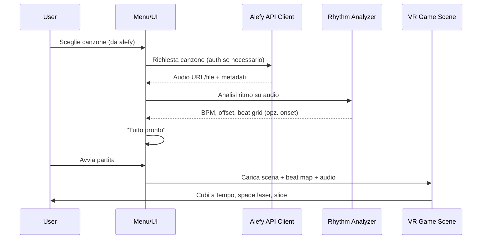

# Piano: Gioco VR stile Beat Saber con canzoni da alefy.alevale.it

## Stack e prerequisiti

- **Engine**: Unity 2022 LTS (o 2021 LTS) – supporto Oculus Rift S e XR Interaction Toolkit maturo.
- **VR**: Oculus XR Plugin + XR Interaction Toolkit (controller, tracking, input).
- **Piattaforma**: Windows, build PC per Rift S (OpenXR/Oculus).
- **Linguaggio**: C# (Unity); eventuale servizio/script per analisi ritmo in C# o tool esterno.

---

## Ambiente di sviluppo

**Percorso consigliato**: tutto il progetto vive nel repo `meta`. Il progetto Unity in una sottocartella dedicata:

```
c:\Users\Valerio\meta\
├── PLAN.md
├── .gitignore          (ignora BeatSaberAlefy/Library, Temp, ecc.)
└── BeatSaberAlefy\     ← root progetto Unity (apri questa cartella in Unity)
    ├── Assets\
    ├── ProjectSettings\
    ├── Packages\
    └── ...
```

**Sistema operativo consigliato**: **Windows 10/11 (64-bit)**. L’Oculus Rift S e il software Oculus/Meta sono supportati ufficialmente solo su Windows; Unity + Oculus XR Plugin sono testati su Windows. Sviluppare lo stesso progetto su macOS/Linux è possibile ma non puoi testare il Rift S su quella macchina.

---

## Programmi e dipendenze da installare

**Obbligatori**

| Programma | Versione / note | A cosa serve |
| --------- | ----------------- | ------------ |
| **Unity Hub** | Ultima LTS | Gestione installazioni Unity e progetti |
| **Unity** | 2022 LTS (es. 2022.3.x) | Engine di gioco |
| **Cursor** o **Visual Studio** o **VS Code** | VS 2022 con workload “Game development with Unity” o VS Code + C# extension | IDE per C# e debug |
| **Oculus App** (Meta Quest / Rift) | Ultima da [meta.com/quest/setup](https://www.meta.com/quest/setup) o [oculus.com/setup](https://www.oculus.com/setup) | Driver e runtime per Rift S; necessario per test in VR |
| **Git** | 2.x | Versionamento (repo `meta`) |

**Installazione Unity**: da Unity Hub aggiungi modulo **Unity 2022 LTS** e, per il build target **Windows**, il modulo **Windows Build Support**. Se usi Visual Studio come editor aggiungi anche **Microsoft Visual Studio Community**; con **Cursor** o **VS Code** non serve: in Unity imposta *Edit → Preferences → External Tools → External Script Editor* su Cursor (o VS Code). Poi nel progetto Unity, da Package Manager: **Oculus XR Plugin**, **XR Interaction Toolkit**, **OpenXR Plugin** (se richiesto da Oculus).

**Opzionali**

- **GitHub Desktop** o **GitHub CLI** (`gh`): se preferisci un client grafico o CLI per push/pull.
- **NAudio** (NuGet): solo se usi lettura audio avanzata in C# fuori da Unity; in Unity spesso basta `UnityEngine.Audio`.

---

## Risorse hardware per dimensionare la macchina

**Minime (solo sviluppo, test VR leggero)**

- **CPU**: Intel i5 / Ryzen 5 (6 core) o equivalente.
- **RAM**: 16 GB (Unity + Visual Studio + Oculus + browser possono usare 12–14 GB).
- **GPU**: dedicata NVIDIA GTX 1060 6 GB / AMD RX 580 o superiore (requisiti ufficiali Oculus Rift S).
- **Disco**: SSD 256 GB minimo; Unity + Hub + un progetto possono usare 20–40 GB; meglio 512 GB per progetti e cache.
- **Porte**: DisplayPort 1.2 (o Mini DisplayPort con adattatore) per Rift S + USB 3.0.

**Consigliate (sviluppo fluido + test VR frequenti)**

- **CPU**: Intel i7 / Ryzen 7 (8 core) o superiore.
- **RAM**: 32 GB.
- **GPU**: NVIDIA RTX 3060 / AMD RX 6600 o superiore (margine per editor Unity e VR contemporaneamente).
- **Disco**: NVMe SSD 512 GB o 1 TB.
- **Monitor**: 1080p o superiore; secondo monitor utile per doc e IDE mentre il Rift S è sul visore.

**Riferimenti ufficiali**

- [Requisiti di sistema Oculus Rift S](https://www.meta.com/quest/products/accessories/headsets/rift-s/)
- [Requisiti Unity per Windows](https://docs.unity3d.com/Manual/system-requirements.html)

---

## Architettura del flusso



1. **Menu/lobby**: selezione canzone (lista da API alefy o ricerca). Autenticazione API con credenziali che fornirai.
2. **Download/preparazione**: ottenere da alefy l'audio (URL stream/download o file) e eventuali metadati (titolo, artista, BPM se già presenti).
3. **Analisi ritmo**: su audio ricevuto calcolare BPM, offset prima battuta e griglia dei beat (e opzionalmente onset per colpi più precisi). Finché analisi non è completata non si considera "pronto".
4. **Ready → Play**: quando BPM/offset/beat grid sono pronti, abilitare "Avvia partita" e caricare la scena VR con beat map e audio.
5. **Gameplay**: ambiente sci-fi, cubi che arrivano a tempo, due spade laser (controller Rift S), slice a tempo.

## 1. Integrazione API alefy.alevale.it

- **Modulo**: client API in C# (Unity) o, se preferisci, piccolo backend (es. Node/Python) che espone a Unity un endpoint locale.
- **Da definire con la documentazione che fornirai**:
  - Endpoint per elenco/cerca canzoni.
  - Endpoint per dettaglio canzone e **URL/file audio** (stream o download).
  - Autenticazione (token, API key, OAuth, ecc.).
- **In Unity**: servizio `AlefyService` (o simile) che:
  - Chiama l'API con le credenziali.
  - Scarica o streama l'audio e lo salva in cache (es. `Application.temporaryCachePath`).
  - Espone al resto del gioco: percorso file audio locale + metadati (titolo, artista, BPM se presente).
- **Fallback**: se l'API non fornisse l'audio direttamente, il piano prevede di usare solo metadati da alefy e richiedere all'utente di fornire il file audio (stesso flusso di analisi e gioco).

**Deliverable**: interfaccia `IAlefyClient` + implementazione concreta quando avrai condiviso docs/credenziali.

---

## 2. Analisi del ritmo (BPM, offset, beat grid)

- **Quando**: dopo aver ottenuto il file audio (da alefy o upload). In un menu "Preparazione" o schermata di caricamento.
- **Algoritmo**: uso di un algoritmo collaudato in C#:
  - **AudioSync** (BPM + offset, stile ArrowVortex) – adatto a ritmo costante.
  - Oppure **onset detection** (spectral flux o simile) per beat più precisi e BPM variabile.
- **Output**:
  - `BPM` (float).
  - `FirstBeatOffset` (secondi) per allineare la griglia al primo beat.
  - Opzionale: lista di tempi (in secondi o in beat) per ogni beat/onset da usare per spawn dei cubi.
- **Implementazione**: in Unity (C#) leggendo l'audio con `UnityEngine.Audio` o NAudio; oppure tool esterno che produce un JSON (BPM, offset, lista beat) e Unity carica quel JSON.
- **"Tutto pronto"**: il gioco considera pronto lo start quando:
  - Audio è disponibile.
  - Analisi è completata (BPM e offset calcolati; opzionale beat list).
  - Beat map generata (vedi sotto).

**Deliverable**: `RhythmAnalyzer` che prende un clip/percorso audio e restituisce una `RhythmData` (BPM, offset, array di beat time).

---

## 3. Generazione beat map e spawn cubi

- **Beat map**: struttura dati (es. lista di "note") con tempo in beat o secondi. Per la prima versione si può generare **automaticamente** dalla griglia ritmica:
  - Un cubo ogni N beat (es. ogni beat, o ogni 2) per mantenere il ritmo.
  - Posizione: variante laterale (sinistra/destra) e altezza (alto/centro/basso) per varietà, in modo simile a Beat Saber.
- **Formato**: classe C# tipo `BeatMapEntry { float time; int lane; int height; }` e lista; salvataggio opzionale in JSON per debug o per mappe future manuali.
- **Spawn**: in gameplay, un `SpawnController` che:
  - Avanza il tempo in base all'audio (sync con `AudioSource.time` o `AudioSettings.dspTime`).
  - Per ogni beat (o entry della beat map) istanzia un cubo nella lane/altezza corretta.
  - I cubi si muovono verso il player con velocità costante così che arrivino "a tempo" nel punto di slice (davanti al giocatore).

**Deliverable**: `BeatMapGenerator` (da RhythmData), `SpawnController`, prefab cubo con collider e logica slice.

---

## 4. Ambiente VR e controller (Oculus Rift S)

- **Scene**: una scena "Game" con:
  - XR Origin (Rift S): head + left/right controller.
  - Ambiente sci-fi: skybox, geometria/tunnel/corridoio, illuminazione neon/stile Beat Saber (colori vivaci, nero/blu, glow).
- **Spade laser**:
  - Due oggetti (mesh cilindro/allungato o modello "saber") figli dei controller (Left/Right).
  - Traccia (trail) opzionale per effetto visivo.
  - **Input**: posizione/rotazione dai controller Rift S tramite XR Interaction Toolkit (pose del device); nessun pulsante necessario per il movimento, solo per eventuale menu/pause.
- **Collisione slice**:
  - Ogni cubo ha un collider (box) e uno script che rileva l'intersezione con il "saber" (collider su una delle due spade).
  - Slice valido se: cubo tagliato nel **timing window** (es. ±200 ms dal beat) e con direzione del taglio coerente (opzionale all'inizio).
  - Al slice: disattivare cubo, effetto particelle, suono, punteggio.

**Deliverable**: Prefab XR Origin Rift S, prefab Saber (x2), prefab Cube con `Sliceable` script, `SliceDetector` sulle spade.

---

## 5. Stile visivo "Beat Saber"

- **Ambiente**: tunnel o stanza scura, pareti con griglia/linee neon, colori saturi (blu, rosa, viola, cyan).
- **Cubi**: facce con direzione obbligata (freccia o colore) opzionale in v1; colori diversi per mano sinistra/destra se vuoi.
- **Spade**: emissive, colore per mano; trail con shader semplice.
- **Post-processing**: bloom leggero, eventuale color grading per look "neon".
- **Audio**: sync rigoroso: `AudioSource` avviato con offset e velocità 1.0; spawn e timing window basati su `AudioSource.time` o `dspTime`.

---

## 6. Struttura progetto Unity (suggerita)

```
Assets/
  Alefy/           → Script API client, configurazione URL e auth
  Audio/           → RhythmAnalyzer, RhythmData, eventuali clip di test
  BeatMap/         → BeatMapGenerator, BeatMapEntry, SpawnController
  VR/              → Setup XR Origin, Saber, input
  Environment/     → Scene, prefab tunnel/sci-fi, luci
  Cubes/           → Prefab cubo, Sliceable, effetti slice
  UI/              → Menu selezione canzone, schermata "Analisi in corso", "Pronto – Avvia"
  Settings/        → ScriptableObject per API base URL, key, scene names
```

---

## 7. Ordine di implementazione suggerito

1. **Progetto Unity + VR**: nuovo progetto, Oculus XR Plugin, XR Interaction Toolkit, scena con XR Origin e due cubi statici per test controller e spade.
2. **Spade e slice**: prefab spada per mano, collider, script di slice su cubi statici (senza ancora beat).
3. **Audio e ritmo**: caricamento file audio locale (test), `RhythmAnalyzer` (BPM + offset), struttura `RhythmData`.
4. **Beat map e spawn**: generazione automatica da `RhythmData`, `SpawnController` che fa arrivare i cubi a tempo; sync con `AudioSource`.
5. **Integrazione alefy**: client API (con docs che fornirai), menu selezione canzone, download/cache audio, collegamento con analisi e avvio partita.
6. **Ambiente e polish**: scena sci-fi, effetti, trail spade, feedback slice, UI "Tutto pronto" e "Avvia".

---

## Dipendenze da te

- **Documentazione API alefy.alevale.it**: endpoint (liste canzoni, dettaglio, URL audio), metodo di auth, formato risposta (JSON, ecc.).
- **Credenziali**: come gestirle in Unity (env, ScriptableObject, o backend proxy) senza esporre segreti nel build.
- **Formato audio fornito dall'API**: stream URL, link download, o solo metadati (in quel caso fallback upload file).

---

## Riepilogo tecnico

| Componente    | Scelta                                                            |
| ------------- | ----------------------------------------------------------------- |
| Engine        | Unity 2022 LTS                                                    |
| VR            | Oculus XR Plugin + XR Interaction Toolkit (Rift S)                |
| Canzoni       | Client API alefy (dettagli da tua docs) → audio + metadati        |
| Analisi ritmo | C# in Unity (es. AudioSync-style BPM+offset o onset) → RhythmData |
| Beat map      | Generata da RhythmData; spawn cubi a tempo con AudioSource sync   |
| Gameplay      | Cubi spawn → movimento verso player → slice con spade a tempo    |
| Stile         | Ambiente sci-fi neon, cubi colorati, spade con trail, bloom       |

Quando hai la documentazione dell'API alefy (e preferenza su dove tenere le credenziali), si può dettagliare l'implementazione del client e il flusso esatto menu → analisi → "Tutto pronto" → avvio partita.
